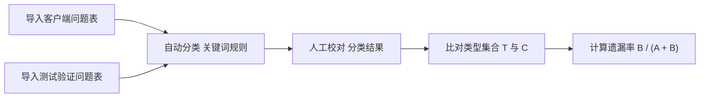
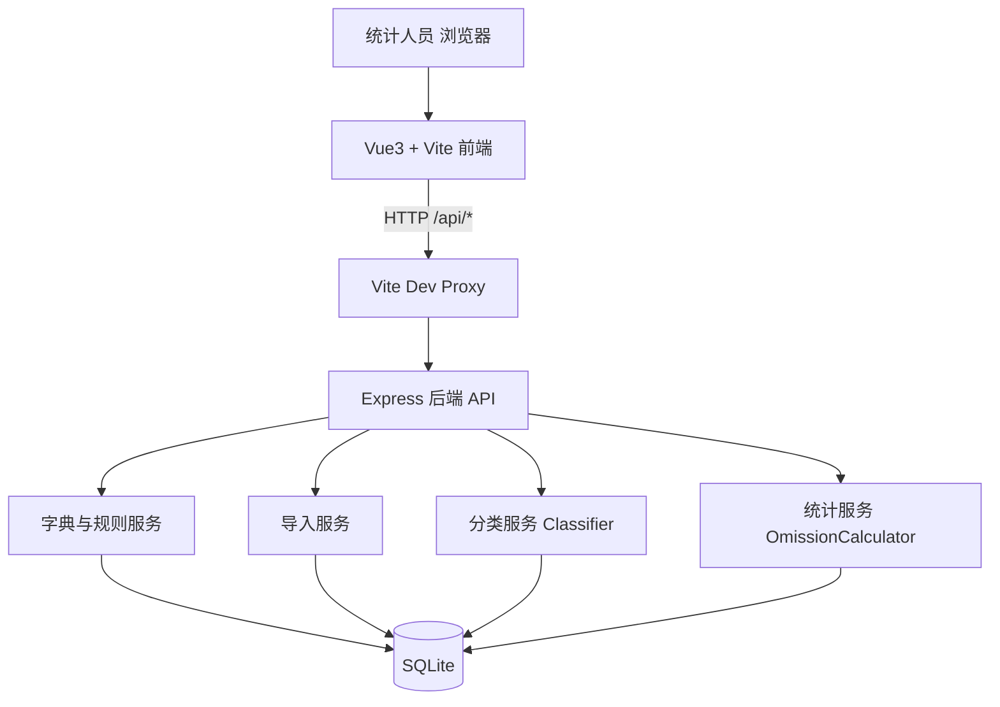
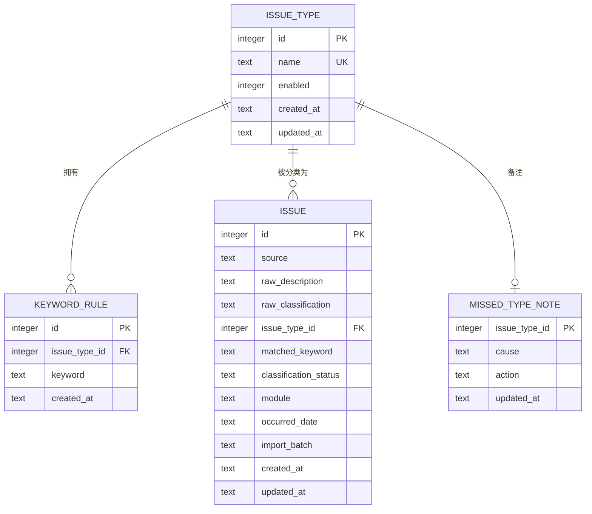

# 问题遗漏率统计工具 技术设计

Feature Name: 2026-09-28-issue-omission-rate
Updated: 2026-09-28

## Description

本设计描述「问题遗漏率统计工具」的技术实现方案。工具是前后端分离的 Web 应用：Vue 3 单页前端负责类型与规则维护、双表导入、分类校对与统计看板；Node.js Express 后端提供 REST 接口，基于 SQLite 持久化问题类型、关键词规则与问题记录。

核心流程：

## Architecture

分层：路由层 `routes/`、业务服务层 `services/`、数据访问层 `repositories/`。导入时在事务内完成「清空可选 + 校验 + 自动分类 + 批量写入」，保证一致性。

## Components and Interfaces

### 前端页面

| 组件/页面 | 职责 |
|-----------|------|
| `DashboardView` | 展示 A、客户端问题类型数 C、B、重叠、遗漏率、待分类数，支持时间范围与项目筛选，ECharts 仪表盘；点击 B 卡片展开未测出类型明细，可填写问题原因定位与改进措施并保存；分项目统计表支持按项目下钻与项目重命名 |
| `ImportView` | 两个独立上传区（客户端表 / 测试验证表），列映射、预览、覆盖选项与导入结果 |
| `ClassificationView` | 问题明细列表、筛选、待分类提示、人工指定类型（下拉候选 + 自由输入新类型）、删除明细；人工分类后弹出「学习分类规则」确认框，勾选/补充关键词后写入规则并自动归类待分类记录 |
| `IssueTypeView` | 问题类型字典维护及其关键词规则增删 |
| `api/index.ts` | 封装 REST 调用与统一错误处理 |

### 后端接口

| 方法 | 路径 | 说明 |
|------|------|------|
| GET | `/api/health` | 健康检查 |
| GET | `/api/issue-types` | 查询问题类型，含各自关键词规则 |
| POST | `/api/issue-types` | 新增问题类型 |
| PATCH | `/api/issue-types/:id` | 重命名或启用/停用 |
| DELETE | `/api/issue-types/:id` | 删除类型，被引用时返回 409 |
| POST | `/api/issue-types/:id/rules` | 为类型新增关键词规则 |
| POST | `/api/issue-types/:id/learn` | 确认学习：批量新增关键词规则并自动归类待分类问题 |
| DELETE | `/api/issue-types/rules/:ruleId` | 删除关键词规则 |
| PUT | `/api/issue-types/:id/note` | 保存该问题类型的「问题原因定位」与「改进措施」备注 |
| POST | `/api/imports/preview` | 上传文件返回列信息与预览 |
| POST | `/api/imports/commit` | 按来源、映射与覆盖选项提交导入并自动分类 |
| GET | `/api/issues` | 查询问题明细，支持来源/类型/分类状态/项目/日期筛选 |
| GET | `/api/issues/summary` | 返回各来源记录数与待分类数 |
| GET | `/api/issues/modules` | 返回已使用的项目列表 |
| PATCH | `/api/issues/modules` | 重命名项目：将 `from`（为空表示未标注项目）下所有记录的 `module` 更新为 `to`，返回改动行数与是否合并 |
| GET | `/api/issues/:id/learn-candidates` | 返回该问题描述中可学习的候选关键词 |
| PATCH | `/api/issues/:id` | 人工指定问题类型 |
| DELETE | `/api/issues/:id` | 删除单条问题记录 |
| DELETE | `/api/issues` | 按来源清空问题记录 |
| GET | `/api/stats/omission` | 返回 A、B、客户端问题类型数 C、重叠数、遗漏率与待分类数，支持时间/项目筛选 |
| GET | `/api/stats/missed-types` | 返回 B 明细：问题类型名称、客户端记录数、最多 3 条示例描述、问题原因定位与改进措施，支持时间/项目筛选 |
| GET | `/api/stats/by-project` | 分项目返回 A、B、重叠、遗漏率、客户端问题类型数 C 与待分类数，支持时间筛选 |

### 分类服务 `Classifier`

1. `normalize(text)`：小写化并移除空白与常见标点。
2. 规则来源：所有启用类型的关键词规则，外加类型名称本身作为隐式关键词。
3. `classify(description, ruleIndex)`：在规范化描述中查找命中的关键词，选取最长命中关键词所属类型。
4. 返回值：`{ issue_type_id | null, matched_keyword | null, status: 'auto' | 'pending' }`。
5. 导入优先级：若某行映射了「分类列」且有值，先用该值调用 `classify` 映射类型；未命中时回退到对「问题描述」调用 `classify`。命中「分类列」时 `matched_keyword` 记录原始分类值，便于溯源。

### 学习服务 `LearningService`

1. `suggestKeywords(description, type)`：按标点/空白切分描述得到候选片段；对规范化长度大于 5 的片段追加末尾 4 字与 3 字后缀；候选并排除该类型已有规则、类型名、纯数字与「问题」「异常」「故障」等泛化词，去重后最多返回 6 个。
2. `learnAndReclassify(typeId, keywords)`：将确认的关键词去重后写入 `keyword_rule`；随后用更新后的规则索引，对当前所有「待分类」记录重新 `classify`，命中者更新为自动分类并记录 `matched_keyword`，返回 `{ added, classified }`。
3. 学习由人工确认触发：`ClassificationView` 的人工分类成功后调用候选接口，用户在确认框中勾选/补充关键词，确认后才写入规则。

### 默认字典种子

启动时若 `issue_type` 表为空，`dictionarySeed` 会写入默认的「领域 × 问题性质」分类及各自关键词规则（定义见 `services/dictionary.js`，每个分类的关键词包含领域关键词与该分类覆盖的原始细分分类名别名）。可用 `backend/scripts/init-dictionary.js --reset` 清空并重建。

### 分项目统计服务 `ProjectStats`

1. `projectKey(module)`：去除首尾空格；空值归一为「未标注项目」。
2. `calculateProjectStats(records)`：按项目分组，分别构建测试验证与客户端的问题类型集合，套用与 `OmissionCalculator` 相同的 A／B／重叠／遗漏率口径，并统计各项目待分类数与客户端原始分类去重数。
3. 项目维度的覆盖导入：`issueRepo.removeBySourceAndModules(source, modules)` 仅删除指定来源中与本次导入项目相同的记录（空项目名匹配 `NULL` 或空串），其他项目保留。
4. 项目重命名：`issueRepo.renameModule(from, to)` 将 `from`（空值代表未标注项目）下所有记录的 `module` 更新为 `to`，两个来源一并更新；`to` 与已有项目同名时相当于合并项目。

## Data Models

- `keyword_rule` 对 `(issue_type_id, keyword)` 建唯一约束，类型删除时级联删除规则。
- `issue.issue_type_id` 可空，表示「待分类」；类型被引用时禁止删除。
- `issue.raw_classification` 保存导入时映射的「分类列」原始值，用于看板按原始数据统计客户端问题类型数。
- `issue.classification_status` 取值 `auto` / `manual` / `pending`。
- `issue.occurred_date` 可空，导入时可选择映射该列。
- `issue.module` 承载「项目」维度，用于分项目统计与筛选；空值表示「未标注项目」。
- `missed_type_note` 以 `issue_type_id` 为主键，按问题类型保存「问题原因定位」`cause` 与「改进措施」`action`，类型删除时级联删除备注。
- `source` 取值约束为 `test` / `client`。

## Correctness Properties

1. 去重性：A、B 统计问题类型集合规模，同一类型多行只计一次。
2. 重叠归属：`x ∈ T ∩ C` 计入 A、不计入 B。
3. 未测出定义：`y ∈ C` 当且仅当 `y ∉ T` 时计入 B。
4. 待分类隔离：分类状态为 `pending` 的记录不进入 T 或 C，仅计入待分类数。
5. 值域：`rate ∈ [0, 1]`；`A + B = 0` 时 `rate = 0`。
6. 恒等式：`|T| + |C \ T| = |T ∪ C|`。
7. 客户端类型总量：看板的客户端问题类型数按客户端来源 `raw_classification` 的去重值个数统计，直接反映原始数据，不参与遗漏率计算。
8. 分类确定性：同一条描述在同一规则集合下分类结果稳定。
9. 最长匹配优先：多条规则命中时选择关键词最长的类型。
10. 分类列优先：导入行映射了非空「分类列」时，优先按分类列归类，未命中再回退到描述分类。
11. 字典幂等：仅当字典为空时写入默认分类，重复启动不产生重复类型。
12. 新类型去重：人工输入的类型名称先按大小写不敏感匹配已有类型；不存在时创建，已存在时直接复用，不产生同名类型。
13. 学习范围：主动学习仅向指定类型新增关键词规则，并只重新分类 `pending` 记录，不修改已为 `auto` / `manual` 的分类结果；不写入与已有规则、类型名重复或泛化的关键词。
14. 规则幂等：重复确认同一关键词不会产生重复规则（命中 `keyword_rule` 唯一约束时跳过）。

## Error Handling

| 场景 | 处理策略 |
|------|----------|
| 未映射问题描述列 | 返回 400，提示必须映射问题描述列 |
| 文件无有效行 | 返回 400，提示文件中没有可导入的数据行 |
| 文件格式不支持 | 返回 400，仅支持 `.xlsx` / `.xls` / `.csv` |
| 描述为空的行 | 标记失败行并给出原因，不写入数据库 |
| 类型名称重复 | 返回 409 |
| 关键词重复 | 返回 409 |
| 删除被引用类型 | 返回 409，提示引用数量 |
| 导入范围超出文件大小 | multer 限制 10MB，超限返回 400 |
| 空数据集统计 | 返回 `a=0, b=0, rate=0, pending=N` 并提示无有效数据 |
| 数据库异常 | 统一错误中间件返回 500，记录服务端日志 |

## Test Strategy

- 单元测试：`Classifier` 覆盖无命中、单命中、多命中取最长、大小写与标点归一、类型名隐式命中；`OmissionCalculator` 覆盖空集、单来源、重叠、去重、待分类隔离。
- 接口测试：导入提交（含覆盖模式）、分类校对、类型/规则 CRUD、删除被引用类型 409、统计过滤。
- 前端：统计卡片渲染、待分类提示、导入三步骤交互。
- 端到端：导入两张示例表，校对后核对 `A=4, B=2, overlap=2, rate=33.3%`。

## References

- [^1]: `requirements.md` - 同目录需求文档
- [^2]: (Website) - [Vite server.proxy 配置](https://vitejs.dev/config/server-options.html#server-proxy)
- [^3]: (Website) - [better-sqlite3 文档](https://github.com/WiseLibs/better-sqlite3)
